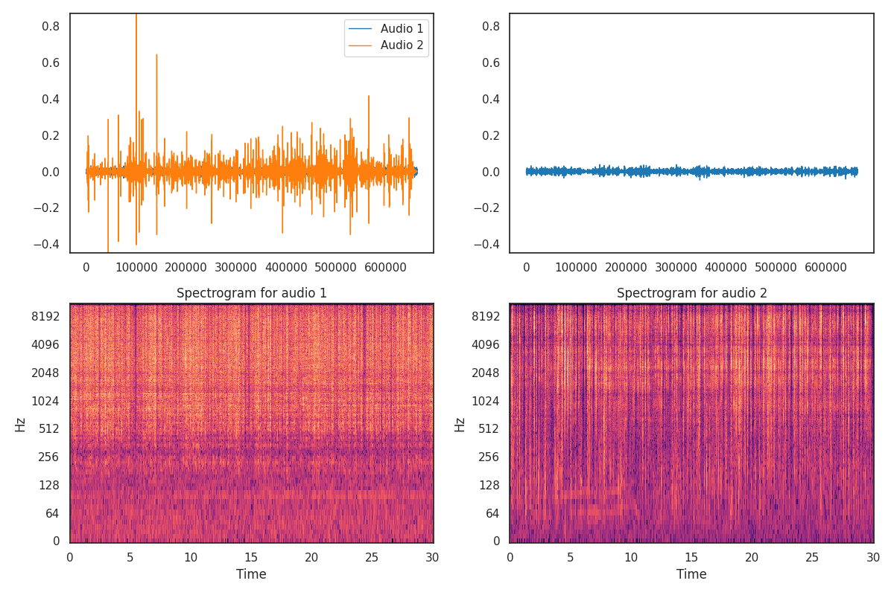

<h1 align="center">Audio comparator, based on Fréchet distance</h1>
   🈳 🇬🇧 This repository uses the "frechet_audio_distance" library (link below) to perform comparisons between ".wav" audio files.
   That library implements three different models to perform the calculations, VGGish, PANN and CLAP, the second being the one used in this program.
   The model performs a comparison of the reference audio with the audio to be compared and returns a result between 0 and 1, with 0 for completely identical audios and 1 for completely different audios.
   The program only uses one audio as a reference, but the implemented lists allow it to be expanded to make a multitude of comparisons and a global average.
  
  🈳 🇪🇦 Este repositorio utiliza la librería "frechet_audio_distance" (enlace más abajo) para realizar comparaciones entre ficheros de audio ".wav".
  Dicha librería implementa tres modelos diferentes para realizar los cálculos, VGGish, PANN y CLAP, siendo el segundo el utilizado en este programa.
  El modelo realiza una comparación del audio referencia con el audio a comparar y devuelve un resultado entre 0 y 1, siendo 0 para audios completamente iguales y 1 para audios completamente diferentes.
  El programa solo utiliza un audio como referencia, pero las listas implementadas permiten ampliarlo para hacer multitud de comparaciones y una media global.
  
- 📠Library <a href="https://github.com/gudgud96/frechet-audio-distance">frechet_audio_distance</a> 
- 📠Model documentation <a href="https://arxiv.org/abs/1912.10211">PANN</a> 
- 📝 Model repository <a href="https://github.com/qiuqiangkong/audioset_tagging_cnn">PANN</a>
  
</img>
  
</img>
